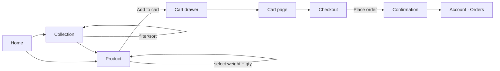
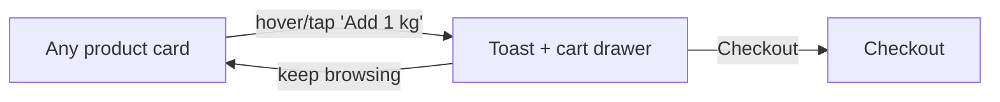
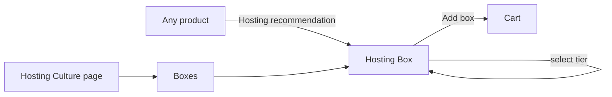
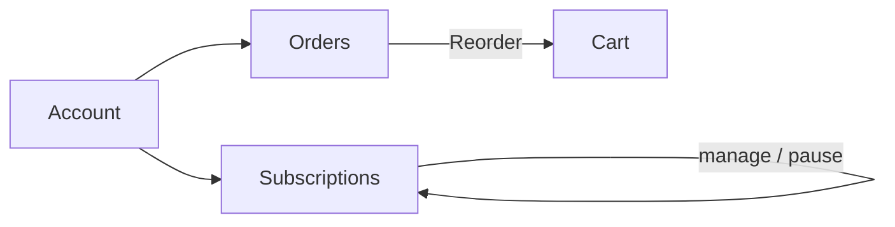

# Information Architecture, Sitemap & User Flows

## 1. Sitemap

```
Home (/)
├── The Collection (/products.html)
│   ├── ?cat=fruits | vegetables | herbs | boxes | seasonal | organic-reserve
│   ├── ?collection=best-sellers
│   ├── Product detail (/product.html?slug=…)        × 35 produce items
│   └── Box detail (/product.html?box=…)             × 5 boxes
├── The New Hosting Culture (/hosting.html)           ← brand differentiator
├── About (/about.html)
│   └── Behind the Quality (#quality)
├── Journal (/journal.html)
│   └── Article (/article.html?slug=…)               × 6 articles
├── Contact (/contact.html)
│   └── Delivery Areas (#areas)
├── Account (/account.html)
│   └── #profile #addresses #orders #wishlist #cards #subscriptions #reorder #settings
├── Cart (/cart.html) → Checkout (/checkout.html) → Confirmation
├── Wishlist (/wishlist.html)
├── Company Policies (/policies.html)
└── Terms of Use (/terms.html)
```

Machine-readable sitemap: `sitemap.xml` (60 URLs). Crawl rules: `robots.txt`
(transactional pages — cart, checkout, account, wishlist — are `noindex` / disallowed).

## 2. Global navigation model

- **Primary nav** (header): Products · The New Hosting Culture · About · Journal · Contact
- **Utility nav** (header icons): Search · Account · Wishlist (count) · Cart (count)
- **Footer**: Shop · The Brand · Care · Account columns + newsletter + payment/social
- **Mobile**: hamburger → left drawer (full nav + account + wishlist); cart → right drawer

The header, footer and drawers are injected once by `app.js` (`renderShell`), so navigation
is identical and maintained in a single place. *(Production: convert to server-side
includes / a component — see DEVELOPER-HANDOFF.)*

## 3. Page blueprints (wireframe-level)

**Home** — Hero ▸ Trust strip ▸ Brand intro ▸ **Hosting Culture (large)** ▸ Best Sellers ▸
Fresh Essentials ▸ Vegetables ▸ Fruits ▸ Boxes ▸ Behind the Quality ▸ Reviews (20) ▸
Journal ▸ Footer.

**Collection** — Page header ▸ sticky filter bar (category pills + result count + sort) ▸
responsive product grid (4→3→2) ▸ box cross-sell.

**Product detail** — Breadcrumb ▸ [sticky gallery | info: rating, price, **weight selector
(live price)**, qty, add+wishlist, assurances, accordion detail/storage/origin/nutrition] ▸
pairings ▸ hosting recommendation ▸ related.

**Checkout** — [① Contact & address · ② Delivery slot · ③ Payment · ④ Review | sticky order
summary] → Confirmation (order #, slot, payment, total).

**Account** — [sticky side-tabs | panel]. Tabs deep-linkable via hash.

## 4. Core user flows (Mermaid)

### Browse → Buy


### Quick add (low-friction)


### Hosting box journey (AOV)


### Returning customer (reorder / subscription)


## 5. Content model (entities)

- **Product** — slug, name, category (fruits/vegetables/herbs), unit (kg/piece/bunch),
  price, origin, season, badges, collections, rating, pairings, storage, nutrition.
- **Box** — slug, name, tagline, image, tiers[label/price/serves], includes[], collections.
- **Collection** — best-sellers, essentials, seasonal, organic-reserve, hosting (tags on products/boxes).
- **Review** — name, area, stars, text, tag.
- **Article** — slug, category, title, image, author, date, read, excerpt, body[].

Single source of truth: `assets/js/data.js`. See DEVELOPER-HANDOFF for the API mapping.
